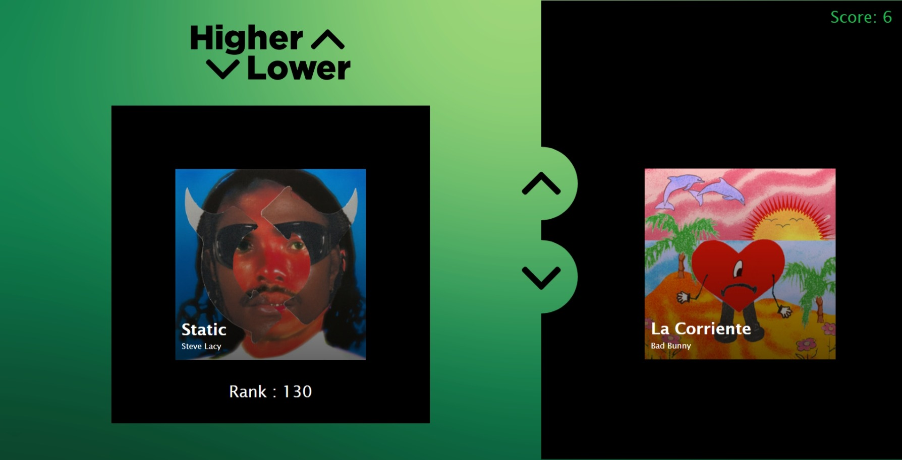
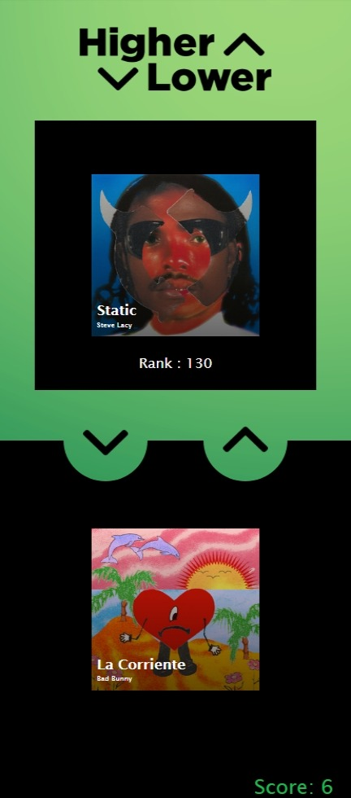

# higherlower
Based of the popular browser game of the same name, our rendition of Higher or Lower has the user guess which songs rank higher or lower on spotify’s top 200 chart.

## Preview

https://styngerbee.github.io/higherlower/

View on mobile

## Description

The motivation behind the project was to test our current knowledge on API’s, and to create a fun, interactive, and unique game with that knowledge. This project helped us better implement the skills that we have learned over the past few weeks and also gain a better understanding on how to use them when programming. Through the creation of this project we also developed better team skills, and learned how to communicate efficiently with our other group members.

## User Story

- Given two songs to compare, with one rank revealed and the other one hidden.
- I want to guess if the hidden rank is higher or lower than the revealed rank.
- Then I press the up-arrow, for higher, and the down-arrow, for lower.
- When correct, I am provided visual feedback,  a popularity widget and the next  comparison.
- When I click the popularity widget, the card flips and the user is given a chart with data regarding the artist’s popularity.
- When incorrect, I am provided visual feedback, a popularity widget and the game ends.
- When the game ends, I am given a score and the option to enter a “username”.
- Then I can save my score to the leaderboard, or play again. 

## Collaborators
- [https://github.com/StyngerBee]
- [https://github.com/Binnyboy1]
- [https://github.com/ken862734801]
- [https://github.com/Zechariahmn]

## API's 
[Google Trends API](https://www.npmjs.com/package/google-trends-api)

[Spotify API](https://rapidapi.com/airaudoeduardo/api/spotify81)

## License 
MIT License

Copyright (c) 2022 Curran Duke, Ian Binstock, Kenshaw Michaud, Zecharian Naitram

Permission is hereby granted, free of charge, to any person obtaining a copy
of this software and associated documentation files (the "Software"), to deal
in the Software without restriction, including without limitation the rights
to use, copy, modify, merge, publish, distribute, sublicense, and/or sell
copies of the Software, and to permit persons to whom the Software is
furnished to do so, subject to the following conditions:

The above copyright notice and this permission notice shall be included in all
copies or substantial portions of the Software.

THE SOFTWARE IS PROVIDED "AS IS", WITHOUT WARRANTY OF ANY KIND, EXPRESS OR
IMPLIED, INCLUDING BUT NOT LIMITED TO THE WARRANTIES OF MERCHANTABILITY,
FITNESS FOR A PARTICULAR PURPOSE AND NONINFRINGEMENT. IN NO EVENT SHALL THE
AUTHORS OR COPYRIGHT HOLDERS BE LIABLE FOR ANY CLAIM, DAMAGES OR OTHER
LIABILITY, WHETHER IN AN ACTION OF CONTRACT, TORT OR OTHERWISE, ARISING FROM,
OUT OF OR IN CONNECTION WITH THE SOFTWARE OR THE USE OR OTHER DEALINGS IN THE
SOFTWARE.
